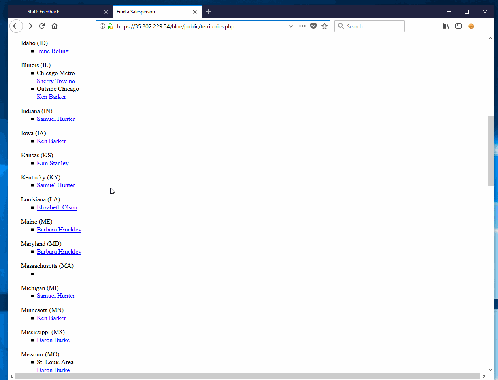
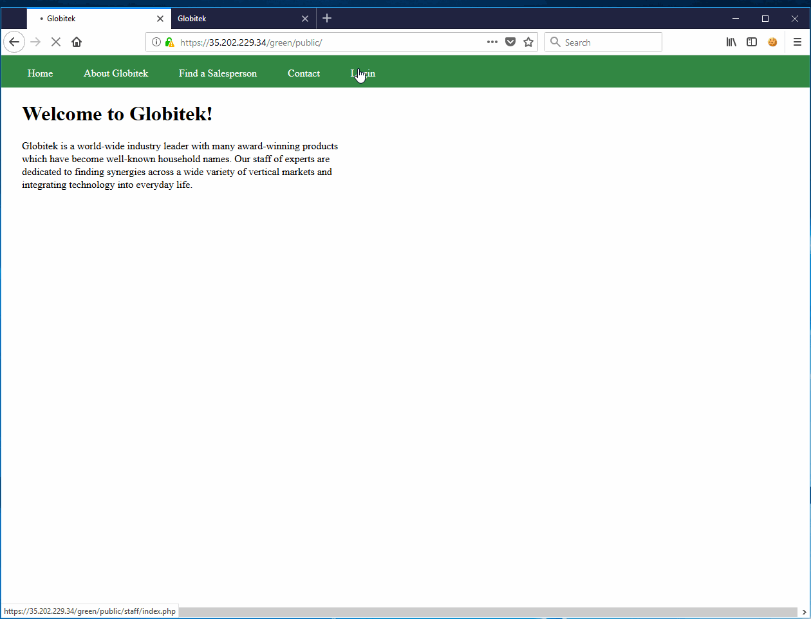
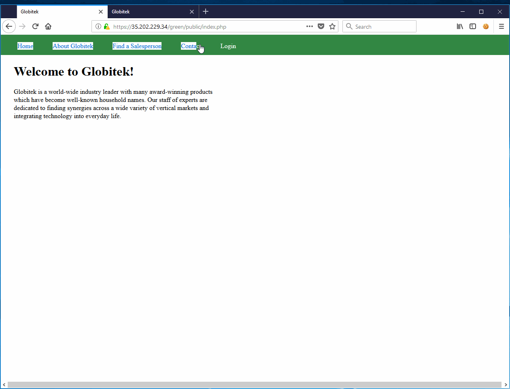
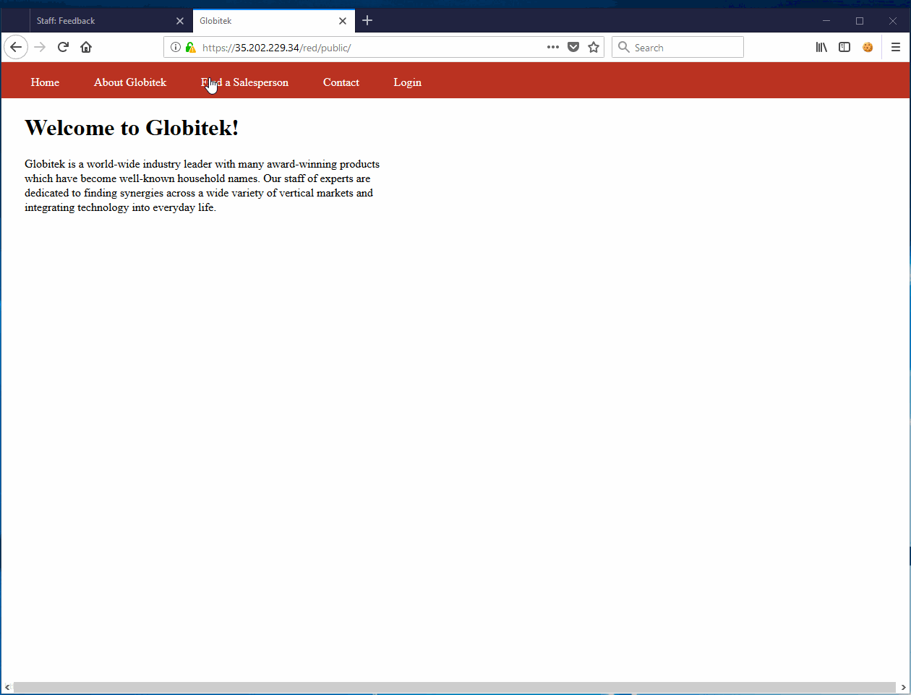
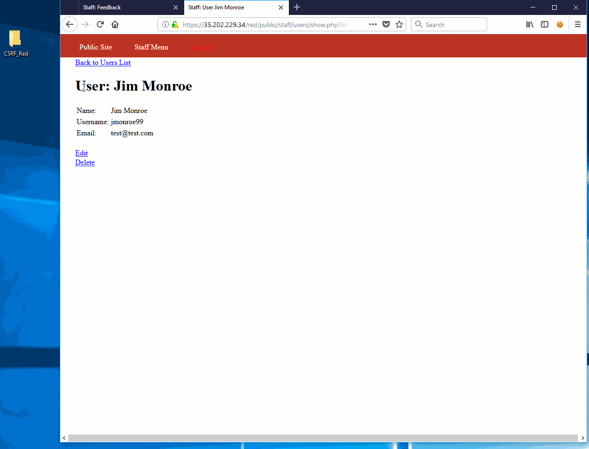

# Project 8 - Pentesting Live Targets

Time spent: **8** hours spent in total

> Objective: Identify vulnerabilities in three different versions of the Globitek website: blue, green, and red.

The six possible exploits are:
* Username Enumeration
* Insecure Direct Object Reference (IDOR)
* SQL Injection (SQLi)
* Cross-Site Scripting (XSS)
* Cross-Site Request Forgery (CSRF)
* Session Hijacking/Fixation

Each version of the site has been given two of the six vulnerabilities. (In other words, all six of the exploits should be assignable to one of the sites.)

## Blue

Vulnerability #1: SQLI

Vulnerability #2: Session Fixation

## Green

Vulnerability #1: Account Enumeration

Vulnerability #2: XSS

## Red

Vulnerability #1: IDOR

Vulnerability #2: CSRF

## Notes

Describe any challenges encountered while doing the work
CSRF presented the most challenges as I needed help creating a page that would automatically submit my form as well as stay hidden. Time limitations made it difficult to complete as CSRF required a large amount of trial and error to work out. I spent a loooong time trying to get SQLI to work on the login pages as well.
